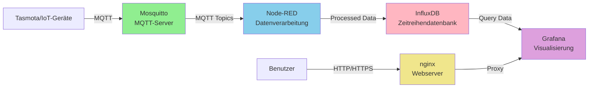

# MintFV: Datenserver

Im Rahmen des Umweltbox Projektes <https://github.com/MintFV/Umweltbox> sollen Daten zentral eingesammelt und visualisiert werden.
Dies soll auf einem Linuxserver mithilfe Docker passieren, der folgende Dockercontainer / Services hochfährt:

1. **nginx** - Webserver / Frontend -- Torwächter / regelt Authentifizierung / WAF für Arme
2. **mosquitto** - MQTT-Server -- Sammelt Daten von den Tasmota oder anderen Geräten ein
3. **nodered** - Verarbeitet die Daten von mosquitto
4. **influxdb** - Zeitreihendatenbank -- speichert die ganzen Daten
5. **grafana** - Visualisierung -- erzeugt die Tabellen und andere Visualisierungen

## Architektur



**Datenfluss:**
1. IoT-Geräte (Tasmota, etc.) senden Sensordaten via MQTT an den Mosquitto-Broker
2. Node-RED abonniert relevante MQTT-Topics und verarbeitet die eingehenden Daten
3. Die verarbeiteten Daten werden in InfluxDB als Zeitreihen gespeichert
4. Grafana liest die Daten aus InfluxDB und erstellt Visualisierungen
5. Benutzer greifen über nginx auf Grafana und andere Web-Frontends zu

## 🚀 Quick Start

### Voraussetzungen

- Linux-Server mit Docker und Docker Compose installiert
- Domain-Name, der auf die Server-IP zeigt (z.B. `mintfv.peddy.net`)
- Ports 80 und 443 müssen von außen erreichbar sein
- Email-Adresse für Let's Encrypt Benachrichtigungen

### Ersteinrichtung

**1. Konfiguration erstellen**

```bash
# Config-Datei aus Beispiel kopieren
cp config-example.yaml config.yaml

# Anpassen mit deinen Daten
nano config.yaml
```

Trage ein:
- `domain`: Deine Domain (z.B. `mintfv.peddy.net`)
- `email`: Deine Email-Adresse
- `letsencrypt.staging`: `true` (für erste Tests mit Staging-Zertifikaten!)

**2. System initialisieren**

```bash
# Vollständige Erst-Initialisierung
./mintfv.sh init
```

Dies erstellt:
- Verzeichnisstruktur
- Dummy SSL-Zertifikate
- Startet nginx und certbot

**3. Services starten**

```bash
./mintfv.sh start
```

**4. Status prüfen**

```bash
# Status aller Services
./mintfv.sh status

# Logs anschauen
./mintfv.sh logs nginx
./mintfv.sh logs certbot

# Webseite testen (HTTP)
curl http://your-domain.com
```

**5. Migration zu Production SSL**

Wenn alles funktioniert, hole echte Let's Encrypt Zertifikate:

```bash
# Wechsel zu Production-Zertifikaten
./mintfv.sh migrate-to-prod
```

Dieser Befehl:
- Stoppt alle Services
- Löscht Staging-Zertifikate
- Holt echte Production-Zertifikate von Let's Encrypt
- Aktiviert SSL-Konfiguration (HTTPS)
- Startet Services neu

**6. HTTPS testen**

```bash
# Testen mit curl
curl -I https://your-domain.com

# Zertifikat prüfen
echo | openssl s_client -showcerts -servername your-domain.com -connect your-domain.com:443 2>/dev/null | openssl x509 -inform pem -noout -text
```

### Vollständiger Workflow

```bash
# 1. Setup
cp config-example.yaml config.yaml
nano config.yaml  # Domain + Email eintragen, staging: true

# 2. Initialisierung
./mintfv.sh init

# 3. Starten
./mintfv.sh start

# 4. Testen (Staging)
curl http://your-domain.com
./mintfv.sh status

# 5. Production aktivieren
./mintfv.sh migrate-to-prod

# 6. HTTPS verifizieren
curl -I https://your-domain.com
```
# Von Staging zu Production wechseln
./mintfv.sh migrate-to-prod
```

### Verfügbare Befehle

```bash
./mintfv.sh init              # Ersteinrichtung
./mintfv.sh start             # Services starten
./mintfv.sh stop              # Services stoppen
./mintfv.sh restart           # Services neu starten
./mintfv.sh status            # Status anzeigen
./mintfv.sh logs [service]    # Logs anzeigen
./mintfv.sh request-cert      # SSL-Zertifikat anfordern
./mintfv.sh enable-ssl        # HTTPS aktivieren
./mintfv.sh disable-ssl       # HTTPS deaktivieren
./mintfv.sh migrate-to-prod   # Zu Production migrieren
./mintfv.sh cleanup           # Alles löschen (Achtung!)
```

## Konfiguration

### config.yaml

Zentrale Konfigurationsdatei für alle Services. Siehe [config-example.yaml](config-example.yaml) für alle Optionen.

**Wichtigste Einstellungen:**

```yaml
domain: mintfv.peddy.net
email: admin@example.com

letsencrypt:
  staging: true              # Immer mit true starten!
  renewal_interval: 12h

services:
  nginx:
    enabled: true
    user_id: 2001
    group_id: 2100
```

### Staging vs. Production

**Let's Encrypt Rate Limits:**
- Staging: Unbegrenzte Test-Zertifikate (nicht vertrauenswürdig)
- Production: 5 Zertifikate pro Woche (vertrauenswürdig)

**Workflow:**
1. Start immer mit `staging: true`
2. Teste alles gründlich
3. Wenn alles läuft: `./mintfv.sh migrate-to-prod`

## Verzeichnisstruktur

```
mintfv/
├── config.yaml              # Deine Konfiguration
├── config-example.yaml      # Konfigurations-Template
├── docker-compose.yaml      # Docker Services
├── mintfv.sh               # Management-Script
│
├── nginx/
│   ├── conf/               # Nginx-Konfiguration
│   │   ├── default.conf    # HTTP-only (aktiv bei Start)
│   │   └── ssl.conf        # HTTPS (nach enable-ssl)
│   ├── html/               # Webseiten-Inhalte
│   └── logs/               # Nginx-Logs [BACKUP]
│
├── certbot/
│   ├── conf/               # SSL-Zertifikate [BACKUP]
│   ├── www/                # ACME-Challenge Dateien
│   └── logs/               # Certbot-Logs [BACKUP]
│
└── [future: mosquitto, nodered, influxdb, grafana]
```

**[BACKUP]** = Diese Verzeichnisse sollten regelmäßig gesichert werden (siehe [BACKUP.md](BACKUP.md))

## Security Features

Alle Services laufen mit maximaler Sicherheit:

- ✅ **Non-root User**: User IDs ab 2001, keine root-Container
- ✅ **Shared Group (GID 2100)**: Sichere File-Sharing zwischen Containern
- ✅ **Read-only Filesystem**: nginx läuft mit read-only root
- ✅ **Capability Dropping**: Alle Capabilities gedroppt, nur notwendige hinzugefügt
- ✅ **No New Privileges**: Verhindert Privilege-Escalation
- ✅ **Resource Limits**: CPU und Memory Limits für alle Container
- ✅ **Automatic Log Rotation**: Max 10MB pro Datei, 3 Dateien behalten
- ✅ **Security Headers**: HSTS, X-Frame-Options, CSP, etc.

Details: [DOCKER.md](DOCKER.md)

## Troubleshooting

### Container startet nicht

```bash
# Logs prüfen
./mintfv.sh logs nginx
./mintfv.sh logs certbot

# Status prüfen
./mintfv.sh status
```

### SSL-Zertifikat kann nicht abgerufen werden

**Prüfe:**
1. DNS funktioniert: `nslookup your-domain.com`
2. Port 80 ist offen: `curl http://your-domain.com/.well-known/acme-challenge/test`
3. nginx ist healthy: `./mintfv.sh status`
4. ACME-Challenge funktioniert: Prüfe nginx-Logs

**Häufige Fehler:**
- Domain zeigt nicht auf Server → DNS prüfen
- Firewall blockt Port 80 → Firewall-Regeln prüfen
- nginx nicht healthy → Container-Logs prüfen

### Migration zu Production fehlgeschlagen

```bash
# Zurück zu Staging
nano config.yaml  # staging: true setzen
./mintfv.sh cleanup
./mintfv.sh init
```

### Kompletter Neustart

```bash
# Alles löschen und neu starten
./mintfv.sh cleanup
./mintfv.sh init
```

## Automatisierung

### Automatic Certificate Renewal

Certbot erneuert Zertifikate automatisch:
- Prüfung alle 12 Stunden (konfigurierbar in config.yaml)
- Erneuerung 30 Tage vor Ablauf
- Keine manuelle Aktion nötig

### Automatic Log Rotation

Docker rotiert Logs automatisch:
- Max 10MB pro Log-Datei
- Max 3 Dateien behalten
- Komprimierung aktiviert

## Services

### Aktive Services

- **nginx** (UID 2001) - Webserver mit HTTPS und Let's Encrypt ✅
- **certbot** (UID 2002) - SSL-Zertifikats-Management ✅
- **grafana** (UID 2006) - Datenvisualisierung ✅
  - Zugriff: `https://mintfv.peddy.net/grafana/`
  - Standard-Login: `admin` / `admin` (bitte ändern!)
- **influxdb** (UID 2005) - Zeitreihendatenbank (InfluxDB 3.8 Core) ✅
  - API-Zugriff: `https://mintfv.peddy.net/influxdb/` (v1/v2/v3 APIs)
  - ⚠️ **Keine Web-UI**: InfluxDB 3 Core hat keine eingebaute Benutzeroberfläche
  - Admin-Token: siehe [INFLUXDB.md](INFLUXDB.md)
  - Setup & Verwendung: siehe [INFLUXDB.md](INFLUXDB.md)
- **nodered** (UID 2004) - Data Processing & Automation ✅
  - Zugriff: `https://mintfv.peddy.net/nodered/`
  - ⚠️ **Nicht Multi-Tenant**: Alle Benutzer teilen sich einen Workspace
  - Initial Setup & Passwort: siehe [NODERED.md](NODERED.md)
  - InfluxDB Integration: siehe [NODERED.md](NODERED.md)

### Zukünftige Services

Folgende Services sind vorbereitet, aber noch nicht aktiviert:

- **mosquitto** (UID 2003) - MQTT Broker

Aktivierung erfolgt in zukünftigen Updates.

## Weiterführende Dokumentation

- [DOCKER.md](DOCKER.md) - Docker-Konventionen und GID-2100-Konzept
- [SSL-SETUP.md](SSL-SETUP.md) - Detaillierte SSL-Einrichtung
- [INFLUXDB.md](INFLUXDB.md) - InfluxDB 3 Core Setup und Verwendung
- [NODERED.md](NODERED.md) - Node-RED Setup, Passwort-Konfiguration und Multi-Tenancy Limitierungen
- [BACKUP.md](BACKUP.md) - Backup-Strategie mit rsync
- [config-example.yaml](config-example.yaml) - Alle Konfigurationsoptionen

## Support & Entwicklung

- GitHub: <https://github.com/MintFV/Umweltbox>
- Issues: Bitte GitHub Issues verwenden

## Lizenz

[Lizenz hier einfügen]

