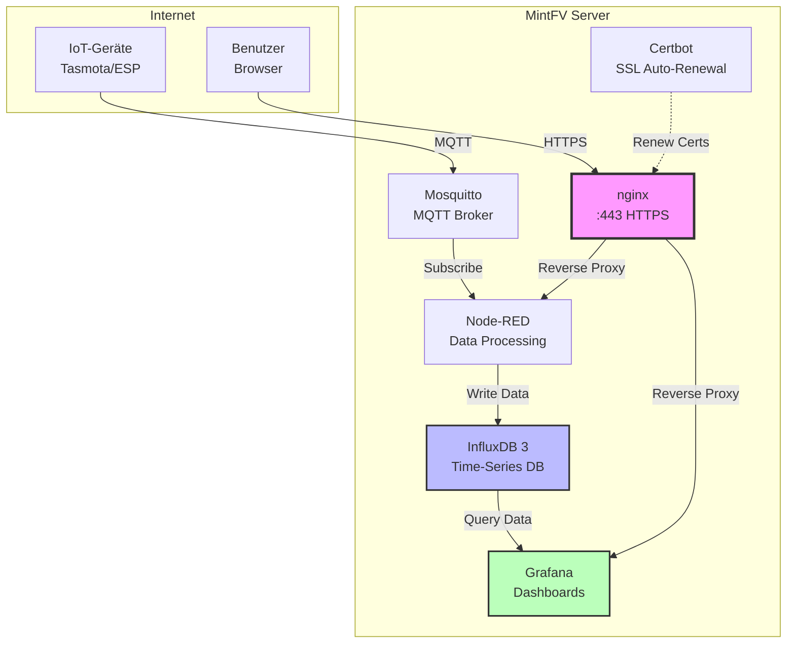
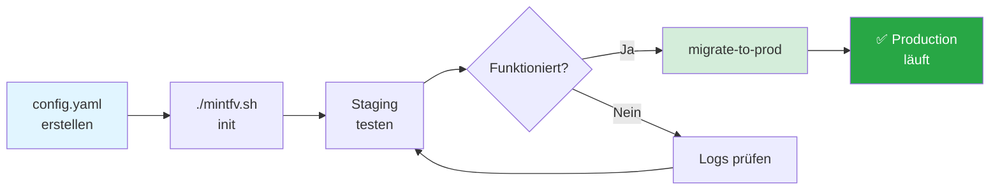
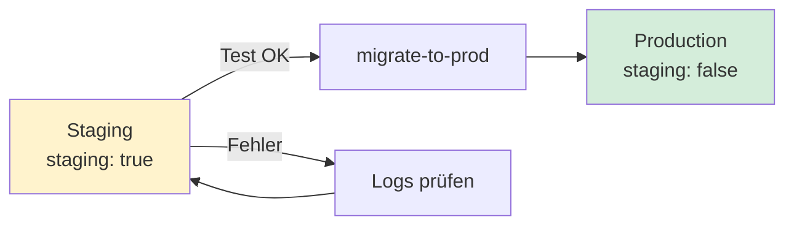

# MintFV Datenserver

> **IoT-Datenplattform** für das [Umweltbox Projekt](https://github.com/MintFV/Umweltbox) - Sammelt, verarbeitet und visualisiert Sensordaten von IoT-Geräten.

[](https://www.docker.com/)
[](https://letsencrypt.org/)
[](DOCKER.md)

---

## 📋 Inhaltsverzeichnis

- [Was ist MintFV?](#-was-ist-mintfv)
- [Features](#-features)
- [Architektur](#-architektur)
- [Quick Start](#-quick-start)
- [Services](#-services)
- [Konfiguration](#-konfiguration)
- [Dokumentation](#-dokumentation)
- [Wartung](#-wartung)
- [Troubleshooting](#-troubleshooting)

---

## 🎯 Was ist MintFV?

MintFV ist eine **containerisierte IoT-Datenplattform** die folgende Komponenten integriert:

- **Datenerfassung**: MQTT Broker (Mosquitto) für IoT-Geräte
- **Datenverarbeitung**: Node-RED für Flow-basierte Logik
- **Datenspeicherung**: InfluxDB 3 für Time-Series Daten
- **Visualisierung**: Grafana für Dashboards
- **Sicherheit**: nginx mit Let's Encrypt HTTPS

**Ziel**: Einfaches, sicheres Setup für Umwelt-Monitoring mit Tasmota/ESP-basierten Sensoren.

---

## ✨ Features

### 🔒 Production-Ready Security
- ✅ **HTTPS** mit automatischen Let's Encrypt Zertifikaten
- ✅ **Non-Root Container** mit dedizierten UIDs (2001-2006)
- ✅ **Read-Only Filesystems** wo möglich
- ✅ **Resource Limits** (CPU/RAM) für alle Services
- ✅ **Security Headers** (HSTS, CSP, X-Frame-Options)

### 🚀 Easy Deployment
- ✅ **One-Command Setup**: `./mintfv.sh init`
- ✅ **Automatic SSL Renewal** alle 12h
- ✅ **Health Checks** für alle Services
- ✅ **Log Rotation** automatisch

### 📊 Complete Stack
- ✅ **MQTT**: Mosquitto Broker (geplant)
- ✅ **Processing**: Node-RED v4.1.2
- ✅ **Database**: InfluxDB 3.8 Core
- ✅ **Visualization**: Grafana Latest
- ✅ **Proxy**: nginx mit Rate-Limiting

---

## 🏗️ Architektur



### Datenfluss

1. **IoT → MQTT**: Sensoren senden Daten via MQTT
2. **MQTT → Node-RED**: Verarbeitung und Filterung
3. **Node-RED → InfluxDB**: Persistierung als Time-Series
4. **Grafana ← InfluxDB**: Visualisierung in Dashboards
5. **Benutzer → nginx → Services**: HTTPS Zugriff auf alle UIs

---

## 🚀 Quick Start

### Voraussetzungen

- **Linux Server** mit Docker & Docker Compose
- **Domain** die auf deinen Server zeigt (DNS konfiguriert)
- **Ports offen**: 80 (HTTP), 443 (HTTPS)
- **Email-Adresse** für Let's Encrypt Benachrichtigungen

```bash
# Docker prüfen
docker --version
docker compose version

# DNS prüfen
nslookup your-domain.com
```

### Setup-Ablauf



### 1️⃣ Repository klonen

```bash
git clone https://github.com/MintFV/Datenhalde.git mintfv
cd mintfv
```

### 2️⃣ Konfiguration erstellen

```bash
# Template kopieren
cp config-example.yaml config.yaml

# Anpassen
vi config.yaml
```

**Wichtig:** Trage deine **Domain** und **Email** ein:

```yaml
domain: mintfv.example.com    # Deine Domain
email: admin@example.com      # Deine Email

letsencrypt:
  staging: true               # ⚠️ Für erste Tests auf 'true' lassen!
```

> 💡 **Tipp**: Starte immer mit `staging: true` um Let's Encrypt Rate-Limits zu vermeiden!

### 3️⃣ System initialisieren

```bash
# Erst-Setup (einmalig)
./mintfv.sh init
```

Dies erstellt:
- Verzeichnisstruktur
- Self-Signed Dummy-Zertifikate
- nginx Container
- Certbot Container

### 4️⃣ Staging-Zertifikate testen

```bash
# Status prüfen
./mintfv.sh status

# HTTP testen
curl -I http://your-domain.com
```

### 5️⃣ Production aktivieren

Wenn Staging funktioniert:

```bash
# Zu echten Let's Encrypt Zertifikaten wechseln
./mintfv.sh migrate-to-prod
```

### 6️⃣ HTTPS verifizieren

```bash
# HTTPS testen
curl -I https://your-domain.com

# Browser: https://your-domain.com
```

### ✅ Fertig!

Deine Services sind jetzt erreichbar:
- **InfluxDB API**: `https://your-domain.com/influxdb/`
- **Grafana**: `https://your-domain.com/grafana/` (Login: `admin`/`admin`)
- **Node-RED**: `https://your-domain.com/nodered/`

---

## 🛠️ Services

| Service | Status | Port | Zugriff | Dokumentation |
|---------|--------|------|---------|---------------|
| **nginx** | ✅ Aktiv | 80, 443 | - | [SSL-SETUP.md](SSL-SETUP.md) |
| **certbot** | ✅ Aktiv | - | Auto-Renewal | [SSL-SETUP.md](SSL-SETUP.md) |
| **InfluxDB 3** | ✅ Aktiv | - | `/influxdb/` | [INFLUXDB.md](INFLUXDB.md) |
| **Grafana** | ✅ Aktiv | - | `/grafana/` | [GRAFANA.md](GRAFANA.md) |
| **Node-RED** | ✅ Aktiv | - | `/nodered/` | [NODERED.md](NODERED.md) |
| **Mosquitto** | ✅ Aktiv | 1883, 9001 | `/mqtt` (WS) | [MOSQUITTO.md](MOSQUITTO.md) |

### Service Details

#### InfluxDB 3 Core
- **Version**: 3.8.0
- **APIs**: v1 (InfluxQL), v2 (Compatibility), v3 (Native)
- ⚠️ **Keine Web-UI**: Nutze Grafana oder CLI
- **Token**: Siehe [INFLUXDB.md](INFLUXDB.md#admin-token-management)

#### Grafana
- **Login**: `admin` / `admin` (beim ersten Login ändern!)
- **Data Sources**: InfluxDB vorkonfiguriert
- **Dashboards**: Import via UI

#### Node-RED
- ⚠️ **Nicht Multi-Tenant**: Ein Workspace für alle User
- **Setup**: Auth-Konfiguration in [NODERED.md](NODERED.md#quick-start-guide)
- **InfluxDB Integration**: Node installieren (siehe Doku)

---

## ⚙️ Konfiguration

### Zentrale Konfigurationsdatei

[`config.yaml`](config-example.yaml) steuert alle Services:

```yaml
# Domain & Email (ANPASSEN!)
domain: mintfv.example.com
email: admin@example.com

# SSL Modus (Start: staging=true, später: false)
letsencrypt:
  staging: true
  renewal_interval: 12h

# Services aktivieren/deaktivieren
services:
  nginx:
    enabled: true
    memory_limit: 128M
  
  influxdb:
    enabled: true
    memory_limit: 512M    # Bei vielen Daten erhöhen
```

💡 **Alle Optionen**: Siehe [`config-example.yaml`](config-example.yaml) für detaillierte Kommentare.

### Staging vs. Production



**Staging**:
- ✅ Unbegrenzte Zertifikats-Requests
- ❌ Browser zeigt Warnung (nicht vertrauenswürdig)
- 🎯 Zum Testen

**Production**:
- ✅ Vertrauenswürdige Zertifikate
- ❌ Rate Limit: 5 Zerts/Woche
- 🎯 Für Live-Betrieb

### Verfügbare Kommandos

```bash
./mintfv.sh init              # Erst-Setup (einmalig)
./mintfv.sh start             # Services starten
./mintfv.sh stop              # Services stoppen
./mintfv.sh restart           # Neustart
./mintfv.sh status            # Status + Health
./mintfv.sh logs [service]    # Logs anzeigen
./mintfv.sh migrate-to-prod   # Staging → Production
./mintfv.sh cleanup           # Alles löschen (⚠️ Vorsicht!)
```

---

## 📚 Dokumentation

### 🚦 Getting Started

| Dokument | Wann nutzen? |
|----------|--------------|
| **[README.md](README.md)** | Du bist hier! Schnelleinstieg |
| **[SSL-SETUP.md](SSL-SETUP.md)** | SSL/HTTPS Details, Troubleshooting |
| **[DOCKER.md](DOCKER.md)** | UID/GID Konzept, Security-Regeln |

### 🔧 Service-Dokumentation

| Service | Dokumentation | Inhalt |
|---------|---------------|--------|
| **InfluxDB** | [INFLUXDB.md](INFLUXDB.md) | Token-Setup, API-Usage, Queries |
| **Grafana** | [GRAFANA.md](GRAFANA.md) | Data Sources, Dashboards |
| **Node-RED** | [NODERED.md](NODERED.md) | Auth-Setup, InfluxDB-Integration |

### 🔐 Operations

| Dokument | Wann nutzen? |
|----------|--------------|
| **[BACKUP.md](BACKUP.md)** | Backup-Strategie, Restore |
| **[DOCKER.md](DOCKER.md)** | Permission-Probleme, neue Services |

### 📖 Quick Reference

<details>
<summary><b>SSL-Zertifikate verwalten</b></summary>

```bash
# Status prüfen
docker compose exec certbot certbot certificates

# Manuell erneuern
docker compose exec certbot certbot renew --force-renewal

# Logs
./mintfv.sh logs certbot
```

📖 Details: [SSL-SETUP.md](SSL-SETUP.md)
</details>

<details>
<summary><b>InfluxDB Daten abfragen</b></summary>

```bash
# Token holen
export TOKEN=$(sudo cat ./influxdb/tokens/admin.token | jq -r '.token')

# Query ausführen
docker compose exec -T -e INFLUXDB3_AUTH_TOKEN="$TOKEN" influxdb \
  influxdb3 query --database mydb "SELECT * FROM measurement LIMIT 10"
```

📖 Details: [INFLUXDB.md](INFLUXDB.md#quick-reference)
</details>

<details>
<summary><b>Node-RED absichern</b></summary>

```bash
# Passwort-Hash generieren
docker compose exec nodered node-red admin hash-pw

# settings.js editieren
vi ./nodered/data/settings.js

# Container neu starten
docker compose restart nodered
```

📖 Details: [NODERED.md](NODERED.md#quick-start-guide)
</details>

<details>
<summary><b>Backup erstellen</b></summary>

```bash
# Alle kritischen Daten
sudo rsync -avz --delete \
  ./influxdb/data/ /backup/mintfv/influxdb/
sudo rsync -avz --delete \
  ./grafana/data/ /backup/mintfv/grafana/
```

📖 Details: [BACKUP.md](BACKUP.md)
</details>

### 🔗 Externe Ressourcen

- **Docker Compose**: https://docs.docker.com/compose/
- **Let's Encrypt**: https://letsencrypt.org/docs/
- **InfluxDB 3**: https://docs.influxdata.com/influxdb3/
- **Grafana**: https://grafana.com/docs/
- **Node-RED**: https://nodered.org/docs/

---

## 🔄 Wartung

### Automatische Prozesse

| Was | Intervall | Konfiguration |
|-----|-----------|---------------|
| **SSL-Renewal** | 12h | `config.yaml: renewal_interval` |
| **Log-Rotation** | Bei 10MB | `docker-compose.yaml: logging` |
| **Health-Checks** | 30s | `docker-compose.yaml: healthcheck` |

### Regelmäßige Aufgaben

#### Wöchentlich
```bash
# Status prüfen
./mintfv.sh status

# Logs auf Fehler prüfen
docker compose logs --tail=100 | grep -i error
```

#### Monatlich
```bash
# Backup erstellen (siehe BACKUP.md)
sudo rsync -avz ./influxdb/data/ /backup/mintfv/influxdb/

# SSL-Zertifikate prüfen
docker compose exec certbot certbot certificates
```

#### Bei Updates
```bash
# Git pullen
git pull

# Images aktualisieren
docker compose pull

# Neu starten
./mintfv.sh restart
```

### Verzeichnisstruktur

```
mintfv/
├── 📄 config.yaml              # Deine Konfiguration (GIT-IGNORED)
├── 📄 config-example.yaml      # Template (IN GIT)
├── 📄 docker-compose.yaml      # Service-Definitionen
├── 🔧 mintfv.sh               # Management-Script
│
├── 📁 nginx/
│   ├── conf/                  # Nginx-Konfig
│   ├── html/                  # Statische Dateien
│   └── logs/                  # ⚠️ BACKUP!
│
├── 📁 certbot/
│   ├── conf/                  # SSL-Zertifikate ⚠️ BACKUP!
│   ├── www/                   # ACME-Challenge
│   └── logs/
│
├── 📁 influxdb/
│   ├── data/                  # Time-Series Daten ⚠️ BACKUP!
│   └── tokens/                # Admin-Token ⚠️ BACKUP!
│
├── 📁 grafana/
│   └── data/                  # Dashboards/Config ⚠️ BACKUP!
│
└── 📁 nodered/
    └── data/                  # Flows ⚠️ BACKUP!
```

⚠️ **BACKUP!** = Kritische Daten, siehe [BACKUP.md](BACKUP.md)

---

## 🔍 Troubleshooting

### Container startet nicht

```bash
# Logs prüfen
./mintfv.sh logs <service>

# Health-Status
docker compose ps

# Neu starten
./mintfv.sh restart
```

### SSL-Zertifikat kann nicht abgerufen werden

**Checkliste:**
1. ✅ DNS korrekt? → `nslookup your-domain.com`
2. ✅ Port 80 offen? → `curl http://your-domain.com`
3. ✅ nginx healthy? → `docker compose ps nginx`
4. ✅ ACME-Challenge funktioniert? → Nginx-Logs prüfen

📖 Detailliertes Troubleshooting: [SSL-SETUP.md](SSL-SETUP.md#troubleshooting)

### Service nicht erreichbar

```bash
# nginx Reverse Proxy prüfen
docker compose exec nginx nginx -t

# Rate Limits prüfen
./mintfv.sh logs nginx | grep "limiting requests"

# Health-Check
curl -I https://your-domain.com/influxdb/health
```

### Permission Denied

```bash
# UID/GID prüfen
ls -la ./influxdb/data/

# Korrigieren (Beispiel InfluxDB: UID 2005, GID 2100)
sudo chown -R 2005:2100 ./influxdb/data/
sudo chmod -R 750 ./influxdb/data/
```

📖 UID/GID Konzept: [DOCKER.md](DOCKER.md)

### Häufige Fehler

| Fehler | Ursache | Lösung |
|--------|---------|--------|
| `rate limit exceeded` | Zu viele Let's Encrypt Requests | Staging nutzen, 1 Woche warten |
| `Connection refused` | Port nicht erreichbar | Firewall prüfen |
| `Permission denied` | Falsche UID/GID | Siehe [DOCKER.md](DOCKER.md) |
| `Lost connection` (Node-RED) | WebSocket Problem | nginx Config prüfen |

---

## 🤝 Support & Entwicklung

- **GitHub**: [MintFV/Datenhalde](https://github.com/MintFV/Datenhalde)
- **Issues**: Bug-Reports über GitHub Issues
- **Pull Requests**: Willkommen!


---

**Letzte Aktualisierung**: 27. Dezember 2025  
**Version**: 1.0
