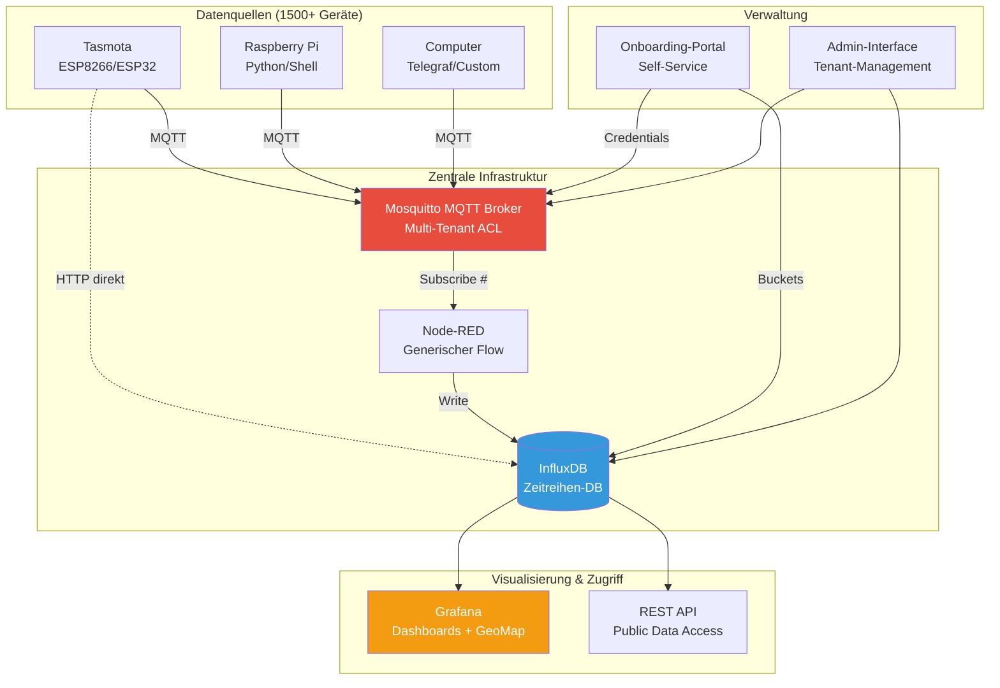
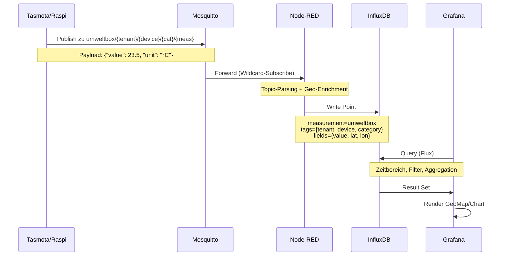
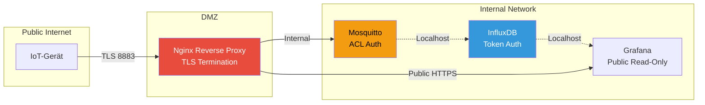

# Umweltbox - Architektur-Übersicht

## 🏗️ System-Architektur

Die Umweltbox nutzt eine bewährte IoT-Architektur mit MQTT als zentralem Message Broker, Node-RED für die Datenverarbeitung und InfluxDB für die Zeitreihenspeicherung.

## 📐 Gesamtarchitektur (High-Level)



## 🔄 Datenfluss (Detailliert)



## 🧩 Komponenten-Details

### 1. MQTT Broker (Mosquitto)

**Funktion**: Zentraler Message Broker für alle Sensordaten

**Konfiguration**:
- Port 8883 (TLS verschlüsselt)
- Multi-Tenant ACL (Access Control Lists)
- Persistenz für QoS 1/2

**ACL-Struktur**:
```
user master-admin
topic readwrite #

user {tenant-id}-admin
topic readwrite umweltbox/{tenant-id}/#

user {tenant-id}-{device-id}
topic write umweltbox/{tenant-id}/#
topic read umweltbox/{tenant-id}/commands/{device-id}/#
```

### 2. Node-RED

**Funktion**: Generische Datenverarbeitung und Routing

**Hauptflows**:
1. **MQTT→InfluxDB Flow**: Topic-Parsing, Geo-Enrichment, DB-Write
2. **Command Flow**: Downlink-Befehle an Geräte (optional)
3. **Monitoring Flow**: System-Health-Checks

**Generischer Topic-Parser**:
```javascript
// Topic: umweltbox/{tenant}/{device}/{category}/{measurement}
const parts = msg.topic.split('/');
const geo = getGeoCoordinates(parts[1], parts[2]); // Lookup aus Registry

msg.payload = [{
    measurement: "umweltbox",
    tags: {
        tenant_id: parts[1],
        device_id: parts[2],
        category: parts[3],
        sensor_type: parts[4]
    },
    fields: {
        value: parseFloat(msg.payload.value || msg.payload),
        latitude: geo.lat,
        longitude: geo.lon,
        unit: msg.payload.unit || ""
    },
    timestamp: Date.now() * 1000000
}];
return msg;
```

### 3. InfluxDB

**Funktion**: Zeitreihen-Datenbank mit Downsampling

**Struktur**:
- **Bucket "umweltbox"**: Rohdaten (5-Minuten-Intervall)
- **Bucket "umweltbox_15m"**: 15-Minuten-Aggregate
- **Bucket "umweltbox_hourly"**: Stündliche Aggregate
- **Bucket "umweltbox_daily"**: Tägliche Aggregate

**Retention Policies** (Szenario "MITTEL"):
- Rohdaten: 30 Tage
- 15-Minuten: 60 Tage
- Stündlich: 275 Tage
- Täglich: ∞

### 4. Grafana

**Funktion**: Visualisierung und Public Dashboards

**Features**:
- GeoMap Panel für räumliche Darstellung
- Time Series für Verläufe
- Heatmaps für Korrelationen
- Public Links (ohne Login)

### 5. Onboarding-Portal

**Funktion**: Self-Service für neue Tenants

**Features**:
- Registrierung (Name, E-Mail, Standort)
- Automatische Credential-Generierung
- Config-Download (YAML für Geräte)
- Dokumentation & Tutorials

## 🔐 Security-Konzept



**Sicherheitsmaßnahmen**:
1. TLS für alle MQTT-Verbindungen
2. ACL-basierte Isolation pro Tenant
3. InfluxDB-Tokens mit Bucket-Beschränkung
4. Nginx als Reverse Proxy mit Rate-Limiting
5. Separate Credentials für Write (Sensoren) und Read (Grafana)

## 💾 Hardware-Anforderungen (Zentrale Infrastruktur)

| Komponente | CPU | RAM | Storage | Netzwerk |
|------------|-----|-----|---------|----------|
| **Mosquitto** | 2 Cores | 2 GB | 10 GB | 1 Gbit/s |
| **Node-RED** | 2 Cores | 4 GB | 5 GB | 1 Gbit/s |
| **InfluxDB** | 4 Cores | 16 GB | 500 GB SSD | 1 Gbit/s |
| **Grafana** | 2 Cores | 4 GB | 10 GB | 1 Gbit/s |
| **Onboarding-Portal** | 1 Core | 2 GB | 5 GB | - |
| **GESAMT** | 11 Cores | 28 GB | 530 GB | - |

**Empfehlung**: Ein dedizierter Server oder VM mit 12 Cores, 32 GB RAM, 1 TB SSD

## 🔧 Deployment

### Docker-Compose Stack

```yaml
version: '3.8'

services:
  mosquitto:
    image: eclipse-mosquitto:2
    ports:
      - "8883:8883"
    volumes:
      - ./mosquitto/config:/mosquitto/config
      - ./mosquitto/data:/mosquitto/data
      - ./mosquitto/log:/mosquitto/log

  nodered:
    image: nodered/node-red:latest
    ports:
      - "1880:1880"
    volumes:
      - ./nodered/data:/data

  influxdb:
    image: influxdb:2
    ports:
      - "8086:8086"
    volumes:
      - ./influxdb/data:/var/lib/influxdb2
    environment:
      - DOCKER_INFLUXDB_INIT_MODE=setup
      - DOCKER_INFLUXDB_INIT_ORG=umweltbox

  grafana:
    image: grafana/grafana:latest
    ports:
      - "3000:3000"
    volumes:
      - ./grafana/data:/var/lib/grafana
```

---

**Erstellt**: Januar 2026  
**Version**: 1.0
