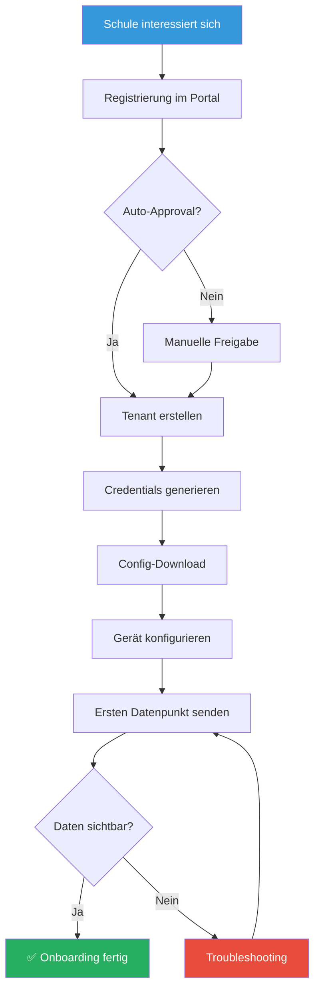

# Umweltbox - Onboarding-Prozess

## 🚀 Ziel des Onboardings

Neue Schulen/Tenants sollen **selbstständig** und **ohne manuelle Eingriffe** ins Umweltbox-Netzwerk integriert werden können. Der Prozess ist designed für:

- **Lehrer*innen** ohne Vorkenntnisse in IoT/Linux
- **Schüler*innen** als Projektarbeit
- **Minimale Support-Anfragen** durch klare Dokumentation

## 📋 Onboarding-Schritte (Übersicht)



## 1️⃣ Registrierung im Onboarding-Portal

### Portal-Features

- **URL**: `https://onboarding.umweltbox.de`
- **Technologie**: Einfaches Web-Frontend (Flask/FastAPI)
- **Authentifizierung**: E-Mail-Verifizierung

### Registrierungs-Formular

```yaml
Schulinformationen:
  - Name der Schule/Organisation
  - Adresse (Straße, PLZ, Ort, Bundesland)
  - Schultyp (Grundschule, Gymnasium, Realschule, AG, Sonstiges)
  - Ansprechperson (Name, E-Mail, Telefon)

Technische Details:
  - Anzahl geplanter Geräte (Schätzung)
  - Gerätetypen (ESP8266, Raspberry Pi, Computer)
  - Sensoren (BME280, SDS011, DHT22, etc.)

Standortdaten:
  - GPS-Koordinaten (optional, wird aus Adresse berechnet)
  - Höhe über NN (optional)

Datenschutz:
  - ☑️ Einverständnis zur Veröffentlichung der Daten (Open Data)
  - ☑️ Datenschutzerklärung gelesen
```

### Automatisierte Verarbeitung

Nach Absenden:
1. **E-Mail-Verifizierung**: Link an Ansprechperson
2. **Tenant-ID generieren**: Aus Formular-Daten
   - Beispiel: "Gymnasium Max Planck, München, Bayern" → `de-by-gym-max-planck`
3. **Auto-Approval** (optional): Bei verifizierten Schulen

## 2️⃣ Tenant-Erstellung (automatisiert)

### Backend-Schritte (via API/Script)

```bash
# 1. MQTT-Credentials erstellen
mosquitto_passwd -b /etc/mosquitto/passwords   "de-by-gym-max-planck-admin" "GENERIERTES_PASSWORT_1"

# 2. ACL-Regeln hinzufügen
cat >> /etc/mosquitto/acl <<EOF
user de-by-gym-max-planck-admin
topic readwrite umweltbox/de-by-gym-max-planck/#
topic read \$SYS/#
EOF

# 3. InfluxDB-Bucket erstellen (via API)
curl -X POST "http://localhost:8086/api/v2/buckets"   -H "Authorization: Token ADMIN_TOKEN"   -H "Content-Type: application/json"   -d '{
    "orgID": "umweltbox-org-id",
    "name": "umweltbox",
    "retentionRules": [{"type": "expire", "everySeconds": 2592000}]
  }'

# 4. InfluxDB-Token generieren (Write-Only für Tenant)
influx auth create   --org umweltbox   --write-bucket umweltbox   --description "de-by-gym-max-planck write token"

# 5. Datenbank-Eintrag (Device-Registry)
INSERT INTO tenants (tenant_id, name, email, lat, lon, created_at)
VALUES ('de-by-gym-max-planck', 'Gymnasium Max Planck', 
        'kontakt@gym-mp.de', 48.1351, 11.5820, NOW());
```

### Generierte Credentials

```yaml
Tenant-ID: de-by-gym-max-planck

MQTT (Admin-Zugang):
  Broker: mqtt.umweltbox.de
  Port: 8883 (TLS)
  Username: de-by-gym-max-planck-admin
  Password: Xy9#mK2$qL8@vN3!
  Topic-Pattern: umweltbox/de-by-gym-max-planck/#

InfluxDB (für direkten Zugriff):
  URL: https://influx.umweltbox.de
  Token: Abc123XyZ...789 (write-only)
  Bucket: umweltbox
  Organization: umweltbox

Grafana (Read-Only):
  URL: https://grafana.umweltbox.de
  Dashboard: https://grafana.umweltbox.de/d/tenant-overview?var-tenant=de-by-gym-max-planck
```

## 3️⃣ Config-Download

### Config-Formate

Das Portal generiert **fertige Konfigurationsdateien** für verschiedene Gerätetypen:

#### Tasmota (ESP8266/ESP32)

`tasmota_config.txt`:
```
Backlog0 MqttHost mqtt.umweltbox.de;   MqttPort 8883;   MqttUser de-by-gym-max-planck-esp01;   MqttPassword Xy9#mK2$qL8@vN3!;   MqttClient esp01;   Topic umweltbox/de-by-gym-max-planck/esp01;   FullTopic %prefix%/%topic%/;   SetOption3 1;   TelePeriod 300
```

**Verwendung**: Über Tasmota-Konsole einfügen

#### Raspberry Pi (Python)

`umweltbox_config.yaml`:
```yaml
mqtt:
  broker: mqtt.umweltbox.de
  port: 8883
  username: de-by-gym-max-planck-raspi01
  password: Xy9#mK2$qL8@vN3!
  tls: true
  
device:
  tenant_id: de-by-gym-max-planck
  device_id: raspi01
  location:
    name: "Schulhof"
    latitude: 48.1351
    longitude: 11.5820

sensors:
  - type: sds011
    port: /dev/ttyUSB0
    interval: 300
  - type: bme280
    i2c_address: 0x76
    interval: 300
```

**Verwendung**: In Python-Script einbinden

#### Telegraf (Computer)

`telegraf.conf`:
```toml
[agent]
  interval = "5m"
  
[[outputs.mqtt]]
  servers = ["ssl://mqtt.umweltbox.de:8883"]
  username = "de-by-gym-max-planck-pc01"
  password = "Xy9#mK2$qL8@vN3!"
  topic_prefix = "umweltbox/de-by-gym-max-planck/pc01"
  
[[inputs.cpu]]
  percpu = false
  totalcpu = true
  
[[inputs.disk]]
  ignore_fs = ["tmpfs", "devtmpfs"]
```

**Verwendung**: Nach `/etc/telegraf/telegraf.conf` kopieren

## 4️⃣ Gerätekonfiguration

### Tasmota ESP32 (Beispiel: BME280 Sensor)

1. **Tasmota flashen** (via Tasmizer/esptool)
2. **WLAN konfigurieren** (via Tasmota AP)
3. **Config einfügen** (über Webinterface → Console)
4. **Sensor konfigurieren**:
   ```
   # I2C konfigurieren
   I2CDriver13 1
   
   # Telemetrie-Topic setzen
   TeleTopic umweltbox/de-by-gym-max-planck/esp01/%prefix%/%topic%/
   ```

5. **Testen**:
   ```
   # In Console:
   Status 10
   # Zeigt MQTT-Status
   ```

### Raspberry Pi mit SDS011 (Beispiel)

1. **Python-Dependencies installieren**:
   ```bash
   sudo apt-get install python3-pip
   pip3 install paho-mqtt py-sds011
   ```

2. **Umweltbox-Script herunterladen**:
   ```bash
   wget https://umweltbox.de/downloads/umweltbox-client.py
   wget https://umweltbox.de/downloads/umweltbox_config.yaml
   ```

3. **Config anpassen** (siehe oben)

4. **Script als Service einrichten**:
   ```bash
   sudo cp umweltbox-client.service /etc/systemd/system/
   sudo systemctl enable umweltbox-client
   sudo systemctl start umweltbox-client
   ```

5. **Logs prüfen**:
   ```bash
   sudo journalctl -u umweltbox-client -f
   ```

## 5️⃣ Erster Datenpunkt & Verifizierung

### Live-Monitoring im Portal

Das Onboarding-Portal zeigt in Echtzeit:
- ✅ MQTT-Verbindung hergestellt
- ✅ Erster Datenpunkt empfangen
- ✅ InfluxDB-Write erfolgreich
- ✅ Daten in Grafana sichtbar

### Manuelle Verifizierung

1. **MQTT-Test** (via mosquitto_sub):
   ```bash
   mosquitto_sub -h mqtt.umweltbox.de -p 8883      -u de-by-gym-max-planck-admin      -P "Xy9#mK2$qL8@vN3!"      -t "umweltbox/de-by-gym-max-planck/#"      --cafile /path/to/ca.crt
   ```

2. **Grafana-Dashboard öffnen**:
   - URL: `https://grafana.umweltbox.de/d/tenant-live`
   - Filter: `tenant_id = de-by-gym-max-planck`
   - Zeitbereich: Letzte 15 Minuten

3. **InfluxDB-Query** (via Flux):
   ```flux
   from(bucket: "umweltbox")
     |> range(start: -15m)
     |> filter(fn: (r) => r.tenant_id == "de-by-gym-max-planck")
     |> limit(n: 10)
   ```

## 6️⃣ Troubleshooting

### Häufige Probleme

| Problem | Lösung |
|---------|--------|
| **MQTT-Verbindung fehlgeschlagen** | Firewall prüfen (Port 8883), Credentials überprüfen, TLS-Zertifikat installieren |
| **Daten kommen nicht in InfluxDB** | Node-RED-Flow prüfen, Topic-Format validieren, Logs checken |
| **Falsche Geo-Koordinaten** | Device-Registry aktualisieren, MQTT-Payload mit `geo`-Feld senden |
| **Sensor sendet keine Daten** | Hardware prüfen, I2C-Adresse checken, Python-Script-Logs |

### Debug-Schritte

1. **MQTT-Ebene testen**:
   ```bash
   # Von Gerät senden (mosquitto_pub)
   mosquitto_pub -h mqtt.umweltbox.de -p 8883      -u de-by-gym-max-planck-esp01      -P "Xy9#mK2$qL8@vN3!"      -t "umweltbox/de-by-gym-max-planck/esp01/environment/temperature"      -m '{"value": 23.5}'      --cafile /path/to/ca.crt
   ```

2. **Node-RED Debug-Log aktivieren**:
   - Debug-Node in Flow einfügen
   - Topic-Parser-Ausgabe loggen

3. **InfluxDB-Write direkt testen**:
   ```bash
   curl -X POST "https://influx.umweltbox.de/api/v2/write?org=umweltbox&bucket=umweltbox"      -H "Authorization: Token ABC123..."      --data-raw "umweltbox,tenant_id=de-by-gym-max-planck,device_id=test,sensor_type=temperature value=99.9"
   ```

## 📧 Support-Kontakt

- **E-Mail**: support@umweltbox.de
- **Forum**: https://forum.umweltbox.de
- **FAQ**: https://docs.umweltbox.de/faq

---

**Erstellt**: Januar 2026  
**Version**: 1.0
