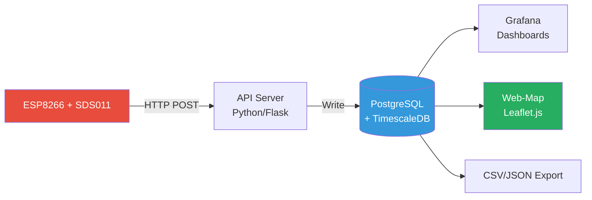
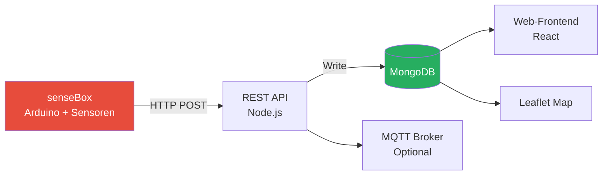
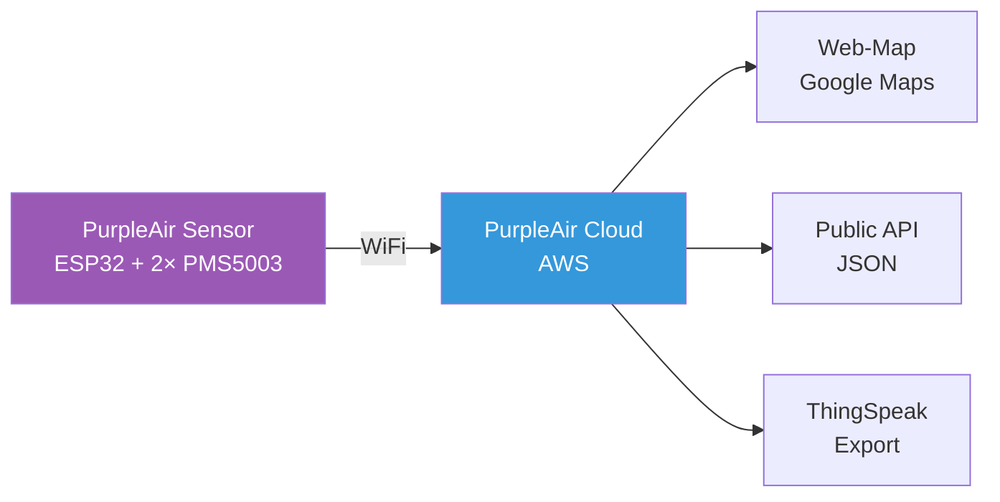
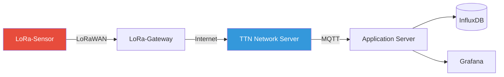
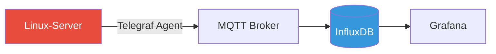
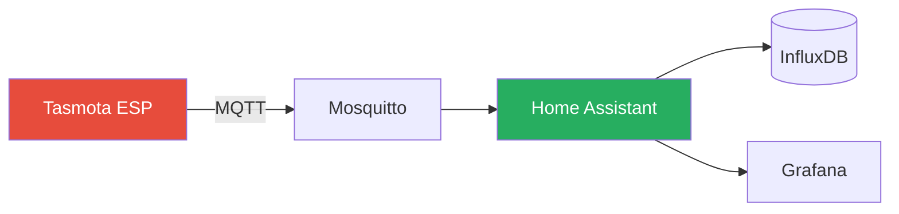

# Umweltbox - Referenzprojekte

## 🌍 Übersicht

Diese Dokumentation sammelt **existierende Citizen-Science- und IoT-Projekte**, die als Inspiration und technische Referenz für das Umweltbox-Projekt dienen. Wir analysieren:

- **Architektur**: Wie ist das System aufgebaut?
- **Technologie-Stack**: Welche Tools werden verwendet?
- **Datenmodell**: Wie werden Daten strukturiert?
- **Lessons Learned**: Was können wir übernehmen/vermeiden?

---

## 1. Sensor.Community (ehem. Luftdaten.info)

### 📊 Projekt-Übersicht

| Eigenschaft | Details |
|-------------|---------|
| **Website** | https://sensor.community/ |
| **Gegründet** | 2015 (Stuttgart, Deutschland) |
| **Fokus** | Feinstaub-Messung (PM2.5, PM10) |
| **Geräte** | ~15.000 weltweit (Stand 2024) |
| **Open Source** | ✅ Ja (GitHub: opendata-stuttgart) |
| **Zielgruppe** | Bürger*innen, Schulen, Kommunen |

### 🏗️ Architektur



### 🔧 Technologie-Stack

| Komponente | Technologie | Details |
|------------|-------------|---------|
| **Hardware** | ESP8266 NodeMCU + SDS011 | ~30€ DIY-Kit |
| **Firmware** | C++ (Arduino) | Custom, nicht Tasmota |
| **Protokoll** | HTTP POST (JSON) | Kein MQTT! |
| **Backend** | Python (Flask) | API + Datenverarbeitung |
| **Datenbank** | PostgreSQL + TimescaleDB | Zeitreihen-Extension |
| **Visualisierung** | Leaflet.js (Custom) | Eigene Web-Map |
| **Hosting** | Hetzner (Deutschland) | Dedicated Server |

### 📡 Datenübertragung

**HTTP-Endpoint**:
```
POST https://api.sensor.community/v1/push-sensor-data/
```

**Payload-Beispiel**:
```json
{
  "software_version": "NRZ-2020-133",
  "sensordatavalues": [
    {"value_type": "P1", "value": "5.38"},
    {"value_type": "P2", "value": "3.45"}
  ]
}

Headers:
X-PIN: 1 (SDS011)
X-Sensor: esp8266-12345678
```

**Unterschied zu Umweltbox**:
- ❌ Kein MQTT (weniger flexibel)
- ❌ Kein Multi-Tenancy
- ✅ Sehr einfach (nur HTTP POST)

### 📊 Datenmodell (PostgreSQL)

```sql
CREATE TABLE sensor_data (
    id SERIAL PRIMARY KEY,
    sensor_id INTEGER,
    sensor_type VARCHAR(50),
    location GEOGRAPHY(POINT, 4326),
    timestamp TIMESTAMPTZ,
    p1 FLOAT,  -- PM10
    p2 FLOAT,  -- PM2.5
    temperature FLOAT,
    humidity FLOAT
);

-- TimescaleDB Hypertable für Performance
SELECT create_hypertable('sensor_data', 'timestamp');
```

### ✅ Was können wir übernehmen?

1. **Einfachheit**: HTTP POST ist für Anfänger leichter als MQTT
2. **DIY-Kits**: Fertige Bauanleitungen für Schulen
3. **Community**: Forum + Wiki für Support
4. **Open Data**: Alle Daten öffentlich via API

### ❌ Was machen wir besser?

1. **MQTT statt HTTP**: Flexibler, weniger Overhead
2. **Multi-Tenancy**: Isolierte Bereiche pro Schule
3. **Generisches System**: Nicht nur Feinstaub, sondern alle Sensoren
4. **InfluxDB**: Bessere Performance für Zeitreihen als PostgreSQL

---

## 2. OpenSenseMap (senseBox)

### 📊 Projekt-Übersicht

| Eigenschaft | Details |
|-------------|---------|
| **Website** | https://opensensemap.org/ |
| **Gegründet** | 2014 (Universität Münster) |
| **Fokus** | Multi-Sensor (Umwelt, Klima, Lärm) |
| **Geräte** | ~10.000 weltweit |
| **Open Source** | ✅ Ja (GitHub: sensebox) |
| **Hardware** | senseBox (Arduino-basiert, ~100€) |

### 🏗️ Architektur



### 🔧 Technologie-Stack

| Komponente | Technologie | Details |
|------------|-------------|---------|
| **Hardware** | senseBox MCU (SAMD21) | Proprietär, ~100€ |
| **Firmware** | Arduino C++ | Blockly-Programmierung für Schüler |
| **Protokoll** | HTTP POST (JSON) | MQTT optional |
| **Backend** | Node.js (Express) | REST API |
| **Datenbank** | MongoDB | NoSQL, flexibles Schema |
| **Visualisierung** | React + Leaflet.js | Custom Web-App |
| **Hosting** | Cloud (Hetzner) | - |

### 📡 Datenübertragung

**HTTP-Endpoint**:
```
POST https://api.opensensemap.org/boxes/:boxId/:sensorId
```

**Payload**:
```json
{
  "value": 23.5,
  "createdAt": "2025-01-03T15:00:00Z"
}
```

**MQTT (optional)**:
```
Topic: /boxes/:boxId/:sensorId
Payload: {"value": 23.5}
```

### 📊 Datenmodell (MongoDB)

```javascript
// Box (Gerät)
{
  _id: ObjectId("..."),
  name: "Grundschule Altona",
  location: {
    type: "Point",
    coordinates: [9.9937, 53.5511]  // [lon, lat]
  },
  sensors: [
    {
      _id: ObjectId("..."),
      title: "Temperatur",
      unit: "°C",
      sensorType: "HDC1080",
      lastMeasurement: {
        value: 23.5,
        createdAt: ISODate("2025-01-03T15:00:00Z")
      }
    }
  ]
}

// Measurements (Zeitreihen)
{
  _id: ObjectId("..."),
  sensor_id: ObjectId("..."),
  value: 23.5,
  createdAt: ISODate("2025-01-03T15:00:00Z")
}
```

### ✅ Was können wir übernehmen?

1. **Pädagogischer Ansatz**: Blockly-Programmierung für Schüler
2. **Multi-Sensor-Support**: Flexible Sensor-Konfiguration
3. **Web-Interface**: Schöne Karten-Visualisierung
4. **Dokumentation**: Sehr gute Tutorials

### ❌ Was machen wir besser?

1. **Günstigere Hardware**: ESP8266 (~5€) statt senseBox (~100€)
2. **InfluxDB statt MongoDB**: Bessere Zeitreihen-Performance
3. **MQTT als Standard**: Nicht optional
4. **Multi-Tenancy**: Isolierte Bereiche pro Schule

---

## 3. PurpleAir

### 📊 Projekt-Übersicht

| Eigenschaft | Details |
|-------------|---------|
| **Website** | https://www.purpleair.com/ |
| **Gegründet** | 2015 (USA) |
| **Fokus** | Luftqualität (PM2.5, PM10) |
| **Geräte** | ~20.000 weltweit |
| **Open Source** | ❌ Nein (proprietär) |
| **Hardware** | PurpleAir Sensor (~250 USD) |

### 🏗️ Architektur



### 🔧 Technologie-Stack

| Komponente | Technologie | Details |
|------------|-------------|---------|
| **Hardware** | ESP32 + 2× PMS5003 | Dual-Sensor für Redundanz |
| **Firmware** | Proprietär | Closed Source |
| **Protokoll** | HTTPS (verschlüsselt) | - |
| **Backend** | AWS (vermutlich) | Nicht öffentlich |
| **Datenbank** | Unbekannt | Vermutlich DynamoDB |
| **Visualisierung** | Google Maps API | - |
| **API** | REST (JSON) | Public, kostenlos |

### 📡 Public API

**Endpoint**:
```
GET https://api.purpleair.com/v1/sensors/:sensor_index
```

**Response**:
```json
{
  "sensor": {
    "sensor_index": 12345,
    "name": "School Sensor",
    "latitude": 37.7749,
    "longitude": -122.4194,
    "pm2.5": 15.2,
    "temperature": 68.5,
    "humidity": 45.0,
    "last_seen": 1704384000
  }
}
```

### ✅ Was können wir übernehmen?

1. **Dual-Sensor-Ansatz**: Redundanz für Qualitätssicherung
2. **Public API**: Einfacher Zugriff für Dritte
3. **Real-Time-Map**: Sehr schnelle Aktualisierung

### ❌ Was machen wir besser?

1. **Open Source**: Transparenz statt Closed Source
2. **Günstigere Hardware**: ESP8266 + SDS011 (~30€) statt PurpleAir (~250 USD)
3. **Eigene Infrastruktur**: Keine Abhängigkeit von kommerziellen Anbietern
4. **Multi-Sensor**: Nicht nur Luftqualität

---

## 4. The Things Network (TTN)

### 📊 Projekt-Übersicht

| Eigenschaft | Details |
|-------------|---------|
| **Website** | https://www.thethingsnetwork.org/ |
| **Gegründet** | 2015 (Niederlande) |
| **Fokus** | LoRaWAN-Infrastruktur (IoT) |
| **Geräte** | >100.000 weltweit |
| **Open Source** | ✅ Ja (GitHub: TheThingsNetwork) |
| **Protokoll** | LoRaWAN (Low Power, Long Range) |

### 🏗️ Architektur



### 🔧 Technologie-Stack

| Komponente | Technologie | Details |
|------------|-------------|---------|
| **Hardware** | LoRa-Module (z.B. RN2483) | Low Power, bis 10 km Reichweite |
| **Protokoll** | LoRaWAN | Lizenzfrei (868 MHz in EU) |
| **Gateway** | Community-betrieben | Freiwillige stellen Gateways bereit |
| **Backend** | Go (TTN Stack v3) | Open Source |
| **Integration** | MQTT, HTTP, Webhooks | Flexible Datenweiterleitung |

### 📡 MQTT-Integration

**Topic-Struktur**:
```
v3/{application_id}/devices/{device_id}/up
```

**Payload**:
```json
{
  "end_device_ids": {
    "device_id": "sensor-01"
  },
  "uplink_message": {
    "decoded_payload": {
      "temperature": 23.5,
      "humidity": 65.0
    },
    "rx_metadata": [
      {
        "gateway_ids": {"gateway_id": "gateway-hamburg"},
        "rssi": -85,
        "snr": 9.5
      }
    ]
  }
}
```

### ✅ Was können wir übernehmen?

1. **Community-Ansatz**: Freiwillige betreiben Infrastruktur
2. **MQTT-Integration**: Einfache Weiterleitung an eigene Systeme
3. **Low Power**: Batterielaufzeit von Jahren möglich

### ❌ Warum nicht für Umweltbox?

1. **Komplexität**: LoRaWAN ist schwieriger als WiFi
2. **Gateway-Abhängigkeit**: Braucht lokale Gateways
3. **Geringere Datenrate**: Nur kleine Pakete (max. 51 Bytes)
4. **Nicht für Schulen geeignet**: WiFi ist einfacher

**Fazit**: Interessant für **ländliche Regionen** ohne WiFi, aber nicht Hauptfokus

---

## 5. Telegraf + InfluxDB (System-Monitoring)

### 📊 Projekt-Übersicht

| Eigenschaft | Details |
|-------------|---------|
| **Website** | https://www.influxdata.com/time-series-platform/telegraf/ |
| **Gegründet** | 2015 (InfluxData) |
| **Fokus** | System-Monitoring (Server, IoT) |
| **Open Source** | ✅ Ja (GitHub: influxdata/telegraf) |
| **Protokoll** | MQTT, HTTP, StatsD, ... |

### 🏗️ Architektur



### 🔧 Konfiguration (telegraf.conf)

```toml
# Input: System-Metriken
[[inputs.cpu]]
  percpu = false
  totalcpu = true

[[inputs.disk]]
  ignore_fs = ["tmpfs", "devtmpfs"]

[[inputs.mem]]

[[inputs.temp]]

# Output: MQTT
[[outputs.mqtt]]
  servers = ["ssl://mqtt.umweltbox.de:8883"]
  topic_prefix = "umweltbox/de-hh-gs-altona/pc-01"
  username = "de-hh-gs-altona-pc01"
  password = "SECRET"
  
  # Topic-Mapping
  [outputs.mqtt.topic]
    cpu = "system/cpu_load"
    disk = "system/disk_usage"
    mem = "system/ram_usage"
    temp = "system/cpu_temp"
```

### ✅ Was können wir übernehmen?

1. **Fertige Lösung**: Kein eigenes Script nötig
2. **Viele Input-Plugins**: CPU, Disk, Netzwerk, Sensoren
3. **MQTT-Output**: Direkt ins Umweltbox-Netzwerk
4. **Cross-Platform**: Linux, Windows, macOS

### 📊 Verwendung in Umweltbox

**Use Case**: Computer-Monitoring in Schulen

**Beispiel-Daten**:
```
umweltbox/de-hh-gs-altona/pc-01/system/cpu_temp
Payload: {"value": 59.3, "unit": "°C"}

umweltbox/de-hh-gs-altona/pc-01/system/cpu_load
Payload: {"value": 42.5, "unit": "%"}
```

---

## 6. Home Assistant (Smart Home)

### 📊 Projekt-Übersicht

| Eigenschaft | Details |
|-------------|---------|
| **Website** | https://www.home-assistant.io/ |
| **Gegründet** | 2013 |
| **Fokus** | Smart Home Automation |
| **Open Source** | ✅ Ja (GitHub: home-assistant) |
| **Geräte** | 1.000+ Integrationen |

### 🏗️ Architektur



### 🔧 MQTT-Integration

**Home Assistant Configuration** (`configuration.yaml`):
```yaml
mqtt:
  broker: mqtt.umweltbox.de
  port: 8883
  username: !secret mqtt_user
  password: !secret mqtt_password
  
sensor:
  - platform: mqtt
    name: "Klassenraum Temperatur"
    state_topic: "umweltbox/de-hh-gs-altona/esp01/environment/temperature"
    unit_of_measurement: "°C"
    value_template: "{{ value_json.value }}"
```

### ✅ Was können wir übernehmen?

1. **MQTT-Discovery**: Automatisches Erkennen von Geräten
2. **Dashboards**: Einfache UI für Nicht-Techniker
3. **Automationen**: Alarme bei Grenzwerten

### ❌ Warum nicht für Umweltbox?

1. **Overhead**: Zu komplex für reines Daten-Logging
2. **Nicht Multi-Tenant**: Nur für eine Instanz designed
3. **Grafana ist besser**: Für Zeitreihen-Visualisierung

**Fazit**: Interessant für **einzelne Schulen**, aber nicht für zentrale Infrastruktur

---

## 📊 Vergleichstabelle

| Projekt | Hardware | Protokoll | Datenbank | Multi-Tenant | Open Source | Kosten/Gerät |
|---------|----------|-----------|-----------|--------------|-------------|--------------|
| **Sensor.Community** | ESP8266 + SDS011 | HTTP | PostgreSQL | ❌ | ✅ | ~30€ |
| **OpenSenseMap** | senseBox MCU | HTTP/MQTT | MongoDB | ❌ | ✅ | ~100€ |
| **PurpleAir** | ESP32 + 2× PMS5003 | HTTPS | Proprietär | ❌ | ❌ | ~250 USD |
| **The Things Network** | LoRa-Module | LoRaWAN | Flexibel | ✅ | ✅ | ~50€ + Gateway |
| **Telegraf** | Jeder Computer | MQTT/HTTP | InfluxDB | ❌ | ✅ | 0€ (Software) |
| **Home Assistant** | Diverse | MQTT | SQLite/PostgreSQL | ❌ | ✅ | 0€ (Software) |
| **🌱 Umweltbox** | ESP8266/Raspi | MQTT | InfluxDB | ✅ | ✅ | ~30€ |

---

## 🎯 Lessons Learned für Umweltbox

### ✅ Best Practices (übernehmen)

1. **Einfache Hardware**: ESP8266 + günstige Sensoren (~30€)
2. **MQTT als Standard**: Flexibler als HTTP
3. **Open Data**: Alle Daten öffentlich via API
4. **Community**: Forum + Wiki für Support
5. **DIY-Kits**: Fertige Bauanleitungen für Schulen
6. **Visualisierung**: Karten + Zeitreihen (Grafana)

### ❌ Fehler vermeiden

1. **Proprietäre Hardware**: Keine Abhängigkeit von teuren Geräten
2. **Closed Source**: Transparenz ist wichtig für Bildungsprojekte
3. **Keine Multi-Tenancy**: Isolierte Bereiche pro Schule sind essentiell
4. **Komplexität**: LoRaWAN ist zu komplex für Schulen
5. **Vendor Lock-In**: Keine Abhängigkeit von Cloud-Anbietern

### 🚀 Unique Selling Points von Umweltbox

1. **Multi-Tenancy**: Erste Plattform mit isolierten Bereichen pro Schule
2. **Generisches System**: Nicht nur Feinstaub, sondern alle Sensoren
3. **Pädagogischer Fokus**: Speziell für Schulen designed
4. **Langzeitarchiv**: 10+ Jahre Daten für wissenschaftliche Auswertungen
5. **DSGVO-konform**: Keine personenbezogenen Daten

---

## 📚 Weiterführende Links

### Sensor.Community
- Dokumentation: https://sensor.community/de/sensors/
- GitHub: https://github.com/opendata-stuttgart
- API: https://api.sensor.community/

### OpenSenseMap
- Dokumentation: https://docs.opensensemap.org/
- GitHub: https://github.com/sensebox
- API: https://docs.opensensemap.org/#api

### PurpleAir
- API-Docs: https://api.purpleair.com/
- Map: https://map.purpleair.com/

### The Things Network
- Dokumentation: https://www.thethingsnetwork.org/docs/
- GitHub: https://github.com/TheThingsNetwork

### Telegraf
- Dokumentation: https://docs.influxdata.com/telegraf/
- GitHub: https://github.com/influxdata/telegraf

---

**Erstellt**: Januar 2026  
**Version**: 1.0  
**Autor**: Umweltbox-Projekt
