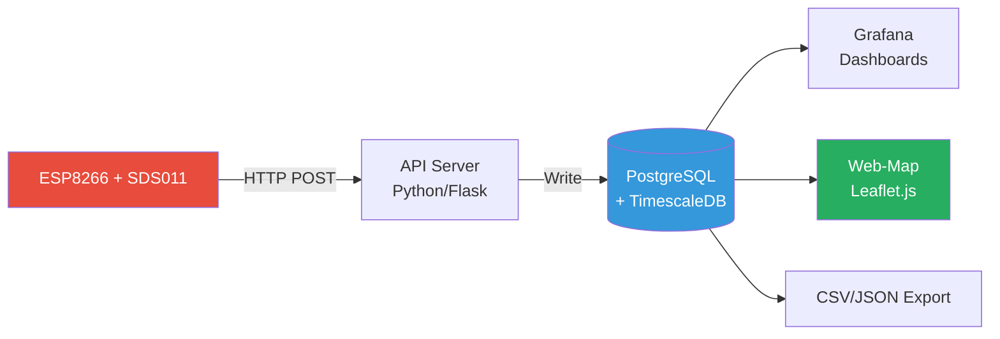
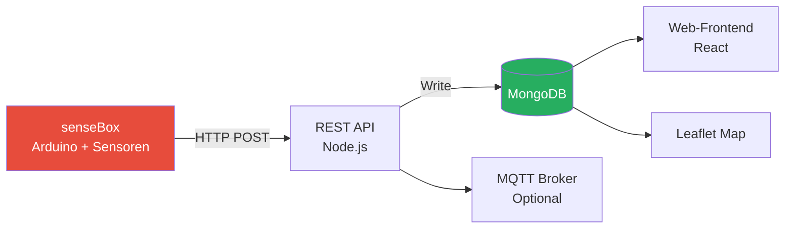

# Umweltbox - Referenzprojekte

## 🌍 Übersicht

Diese Sammlung zeigt **erfolgreiche Citizen-Science- und IoT-Projekte**, die als Inspiration und technische Referenz für das Umweltbox-Projekt dienen. Alle Projekte sind Open Source oder Open Data.

## 📊 Vergleichstabelle

| Projekt | Fokus | Geräte | Daten | Technologie | Lizenz |
|---------|-------|--------|-------|-------------|--------|
| **[Sensor.Community](https://sensor.community/)** | Luftqualität | 15.000+ | Open Data | ESP8266, InfluxDB | CC BY-SA 4.0 |
| **[OpenSenseMap](https://opensensemap.org/)** | Multi-Sensor | 8.000+ | Open Data | Arduino, API | LGPL |
| **[AirGradient](https://www.airgradient.com)** | CO2 + Luftqualität | 5.000+ | Teilweise offen | ESP32, Cloud | Proprietär |
| **[PurpleAir](https://www.purpleair.com/)** | Luftqualität | 20.000+ | Kommerziell | ESP32, Cloud | Proprietär |
| **[Safecast](https://safecast.org)** | Radioaktivität | 1.000+ | Open Data | Custom HW, API | CC0 |
| **[Smart Citizen](https://smartcitizen.me)** | Multi-Sensor | 2.000+ | Open Data | ESP32, API | GPL v3 |
| **[The Things Network](https://www.thethingsnetwork.org/)** | LoRaWAN-Infrastruktur | 100.000+ | Open Data | LoRa, MQTT | AGPL v3 |

---

## 1️⃣ Sensor.Community (ehem. Luftdaten.info)

### 📊 Projekt-Übersicht

| Eigenschaft | Details |
|-------------|---------|
| **Website** | https://sensor.community/ |
| **Gegründet** | 2015 (Stuttgart, Deutschland) |
| **Fokus** | Feinstaub-Messung (PM2.5, PM10) |
| **Geräte** | ~15.000 weltweit (Stand 2024) |
| **Open Source** | ✅ Ja (GitHub: opendata-stuttgart) |
| **Zielgruppe** | Bürger*innen, Schulen, Kommunen |

### 🏗️ Architektur



### 🔧 Technologie-Stack

| Komponente | Technologie | Details |
|------------|-------------|---------|
| **Hardware** | ESP8266 NodeMCU + SDS011 | ~30€ DIY-Kit |
| **Firmware** | C++ (Arduino) | Custom, nicht Tasmota |
| **Protokoll** | HTTP POST (JSON) | Kein MQTT! |
| **Backend** | Python (Flask) | API + Datenverarbeitung |
| **Datenbank** | PostgreSQL + TimescaleDB | Zeitreihen-Extension |
| **Visualisierung** | Leaflet.js (Custom) | Eigene Web-Map |
| **Hosting** | Hetzner (Deutschland) | Dedicated Server |

### 📡 Datenübertragung

**HTTP-Endpoint**:
```
POST https://api.sensor.community/v1/push-sensor-data/
```

**Payload-Beispiel**:
```json
{
  "software_version": "NRZ-2020-133",
  "sensordatavalues": [
    {"value_type": "P1", "value": "5.38"},
    {"value_type": "P2", "value": "3.45"}
  ]
}

Headers:
X-PIN: 1 (SDS011)
X-Sensor: esp8266-12345678
```

**Unterschied zu Umweltbox**:
- ❌ Kein MQTT (weniger flexibel)
- ❌ Kein Multi-Tenancy
- ✅ Sehr einfach (nur HTTP POST)

### 📊 Datenmodell (PostgreSQL)

```sql
CREATE TABLE sensor_data (
    id SERIAL PRIMARY KEY,
    sensor_id INTEGER,
    sensor_type VARCHAR(50),
    location GEOGRAPHY(POINT, 4326),
    timestamp TIMESTAMPTZ,
    p1 FLOAT,  -- PM10
    p2 FLOAT,  -- PM2.5
    temperature FLOAT,
    humidity FLOAT
);

-- TimescaleDB Hypertable für Performance
SELECT create_hypertable('sensor_data', 'timestamp');
```

### ✅ Was können wir übernehmen?

1. **Einfachheit**: HTTP POST ist für Anfänger leichter als MQTT
2. **DIY-Kits**: Fertige Bauanleitungen für Schulen
3. **Community**: Forum + Wiki für Support
4. **Open Data**: Alle Daten öffentlich via API

### ❌ Was machen wir besser?

1. **MQTT statt HTTP**: Flexibler, weniger Overhead
2. **Multi-Tenancy**: Isolierte Bereiche pro Schule
3. **Generisches System**: Nicht nur Feinstaub, sondern alle Sensoren
4. **InfluxDB**: Bessere Performance für Zeitreihen als PostgreSQL

---

## 2️⃣ OpenSenseMap (senseBox)

### 📊 Projekt-Übersicht

| Eigenschaft | Details |
|-------------|---------|
| **Website** | https://opensensemap.org/ |
| **Gegründet** | 2014 (Universität Münster) |
| **Fokus** | Multi-Sensor (Umwelt, Klima, Lärm) |
| **Geräte** | ~10.000 weltweit |
| **Open Source** | ✅ Ja (GitHub: sensebox) |
| **Hardware** | senseBox (Arduino-basiert, ~100€) |

### 🏗️ Architektur



### 🔧 Technologie-Stack

| Komponente | Technologie | Details |
|------------|-------------|---------|
| **Hardware** | senseBox MCU (SAMD21) | Proprietär, ~100€ |
| **Firmware** | Arduino C++ | Blockly-Programmierung für Schüler |
| **Protokoll** | HTTP POST (JSON) | MQTT optional |
| **Backend** | Node.js (Express) | REST API |
| **Datenbank** | MongoDB | NoSQL, flexibles Schema |
| **Visualisierung** | React + Leaflet.js | Custom Web-App |
| **Hosting** | Cloud (Hetzner) | - |

### 📡 Datenübertragung

**HTTP-Endpoint**:
```
POST https://api.opensensemap.org/boxes/:boxId/:sensorId
```

**Payload**:
```json
{
  "value": 23.5,
  "createdAt": "2025-01-03T15:00:00Z"
}
```

**MQTT (optional)**:
```
Topic: /boxes/:boxId/:sensorId
Payload: {"value": 23.5}
```

### 📊 Datenmodell (MongoDB)

```javascript
// Box (Gerät)
{
  _id: ObjectId("..."),
  name: "Grundschule Altona",
  location: {
    type: "Point",
    coordinates: [9.9937, 53.5511]  // [lon, lat]
  },
  sensors: [
    {
      _id: ObjectId("..."),
      title: "Temperatur",
      unit: "°C",
      sensorType: "HDC1080",
      lastMeasurement: {
        value: 23.5,
        createdAt: ISODate("2025-01-03T15:00:00Z")
      }
    }
  ]
}

// Measurements (Zeitreihen)
{
  _id: ObjectId("..."),
  sensor_id: ObjectId("..."),
  value: 23.5,
  createdAt: ISODate("2025-01-03T15:00:00Z")
}
```

### ✅ Lessons Learned (für Umweltbox)

| Aspekt | OpenSenseMap | Umweltbox-Adaption |
|--------|--------------|-------------------|
| **Bildungsansatz** | Sehr stark | Übernehmen! |
| **Hardware-Kosten** | 100-150 € | 30-50 € (günstiger) |
| **Datenbank** | MongoDB | InfluxDB (besser für Zeitreihen) |
| **Onboarding** | Web-Formular | Automatisiert + Config-Download |
| **Multi-Tenancy** | Keine | Ja (wichtig für Schulen) |

**Übernahme**:
- ✅ Unterrichtsmaterialien-Konzept
- ✅ Modularer Sensor-Ansatz
- ✅ Community-Features (Forum, Projekte teilen)

---

## 3️⃣ AirGradient

### 📋 Projekt-Steckbrief

- **Website**: https://www.airgradient.com
- **Start**: 2020 (Thailand/USA)
- **Geräte**: ~5.000 aktive Geräte
- **Fokus**: CO2, PM2.5, Temperatur, Luftfeuchtigkeit
- **Zielgruppe**: Privathaushalte, Schulen, Büros

### 🛠️ Technischer Aufbau

**Hardware**:
- **MCU**: ESP32-C3
- **Sensoren**: 
  - PMS5003 (Feinstaub)
  - SenseAir S8 (CO2)
  - SHT40 (Temperatur, Luftfeuchtigkeit)
- **Display**: OLED (optional)
- **Kosten**: ~80-120 € (DIY-Kit)

**Software**:
- **Firmware**: Open Source (Arduino)
- **Protokoll**: MQTT + HTTP
- **Backend**: Proprietäre Cloud (kostenlos)
- **Alternative**: Lokale InfluxDB-Integration möglich
- **Visualisierung**: Web-Dashboard + Grafana

**MQTT-Topics**:
```
airgradient/{device_id}/pm25
airgradient/{device_id}/co2
airgradient/{device_id}/temperature
```

### 🌟 Besonderheiten

- **Kalibrierung**: Automatische Sensor-Kalibrierung
- **Firmware-Updates**: OTA (Over-The-Air)
- **Display**: Echtzeit-Anzeige am Gerät
- **API**: Öffentliche API für Daten-Export

### ✅ Lessons Learned (für Umweltbox)

| Aspekt | AirGradient | Umweltbox-Adaption |
|--------|-------------|-------------------|
| **Hardware-Qualität** | Sehr hoch | Anstreben (bessere Sensoren) |
| **CO2-Messung** | Ja (wichtig!) | Übernehmen |
| **Display** | Ja | Optional (Kosten) |
| **Cloud** | Proprietär | Open Source (InfluxDB) |
| **Kalibrierung** | Automatisch | Dokumentieren |

**Übernahme**:
- ✅ CO2-Sensor-Integration (wichtig für Schulen!)
- ✅ OTA-Update-Mechanismus
- ✅ Lokale Anzeige (motiviert Schüler*innen)

---

## 4️⃣ Safecast

### 📋 Projekt-Steckbrief

- **Website**: https://safecast.org
- **Start**: 2011 (nach Fukushima-Katastrophe)
- **Geräte**: ~1.000 Geigerzähler
- **Fokus**: Radioaktivität (Gamma-Strahlung)
- **Zielgruppe**: Bürger*innen in Japan, weltweit

### 🛠️ Technischer Aufbau

**Hardware (bGeigie Nano)**:
- **MCU**: Arduino Nano
- **Sensor**: LND 7317 Geiger-Müller-Zählrohr
- **GPS**: NEO-6M
- **Speicher**: SD-Karte (lokale Logs)
- **Kosten**: ~400-500 € (spezialisiert)

**Software**:
- **Firmware**: Open Source (C++)
- **Protokoll**: CSV-Upload via Web
- **Backend**: Ruby on Rails, PostgreSQL
- **API**: RESTful (JSON)
- **Visualisierung**: Leaflet.js (Heatmap)

**Daten-Format**:
```csv
timestamp,latitude,longitude,cpm,usv_h
2025-01-03T14:30:00Z,35.6762,139.6503,42,0.35
```

### 🌟 Besonderheiten

- **Mobile Messungen**: GPS-Tracking während Fahrten
- **Langzeitarchiv**: Daten seit 2011 verfügbar
- **Wissenschaftliche Nutzung**: Peer-reviewed Papers
- **Transparenz**: Alle Rohdaten downloadbar

### ✅ Lessons Learned (für Umweltbox)

| Aspekt | Safecast | Umweltbox-Adaption |
|--------|----------|-------------------|
| **Mobile Sensoren** | Ja (GPS-Tracking) | Übernehmen! |
| **Langzeitarchiv** | 10+ Jahre | Ja (tägliche Aggregate ewig) |
| **Daten-Download** | CSV/JSON | Ja (API + Export) |
| **Wissenschaft** | Viele Papers | Ziel für Umweltbox |

**Übernahme**:
- ✅ GPS-Tracking für mobile Messstationen
- ✅ CSV-Export für Offline-Analysen
- ✅ Langzeitarchivierung (wichtig für Forschung)

---

## 5️⃣ Smart Citizen

### 📋 Projekt-Steckbrief

- **Website**: https://smartcitizen.me
- **Start**: 2012 (Barcelona, Spanien)
- **Geräte**: ~2.000 Smart Citizen Kits
- **Fokus**: Multi-Sensor (Luft, Lärm, Licht)
- **Zielgruppe**: Urbane Communities, Aktivist*innen

### 🛠️ Technischer Aufbau

**Hardware (SCK 2.1)**:
- **MCU**: ESP32
- **Sensoren**: 
  - PMS5003 (Feinstaub)
  - BME680 (Temperatur, Luftfeuchtigkeit, VOC)
  - MEMS-Mikrofon (Lärm)
  - BH1730FVC (Licht)
- **Kosten**: ~150-200 €

**Software**:
- **Firmware**: Open Source (Arduino)
- **Protokoll**: HTTP POST (JSON)
- **Backend**: Python (Django), PostgreSQL
- **API**: RESTful (OpenAPI)
- **Visualisierung**: Custom Web-App (React)

**API-Beispiel**:
```bash
# Geräte-Infos
curl https://api.smartcitizen.me/v0/devices/{device_id}

# Letzte Messwerte
curl https://api.smartcitizen.me/v0/devices/{device_id}/readings
```

### 🌟 Besonderheiten

- **Community-Plattform**: Nutzer können Projekte teilen
- **Daten-Analyse-Tools**: Jupyter Notebooks
- **Kalibrierung**: Community-basierte Kalibrierungs-Algorithmen
- **Integration**: Sensor.Community, OpenAQ

### ✅ Lessons Learned (für Umweltbox)

| Aspekt | Smart Citizen | Umweltbox-Adaption |
|--------|---------------|-------------------|
| **Community-Features** | Sehr stark | Übernehmen (Forum, Projekte) |
| **Lärm-Messung** | Ja | Optional (Datenschutz!) |
| **Jupyter-Integration** | Ja | Für Schulen interessant |
| **Kalibrierung** | Community | Dokumentieren |

**Übernahme**:
- ✅ Community-Plattform (Projekte teilen)
- ✅ Jupyter-Notebooks für Schüler-Analysen
- ✅ Lärm-Sensor (optional, mit Datenschutz-Hinweis)

---

## 🎁 Bonus: Weitere Projekte

### PurpleAir

**Projekt-Übersicht**:
- **Website**: https://www.purpleair.com/
- **Gegründet**: 2015 (USA)
- **Fokus**: Luftqualität (PM2.5, PM10)
- **Geräte**: ~20.000 weltweit
- **Open Source**: ❌ Nein (proprietär)

**Hardware**: ESP32 + 2× PMS5003 (Dual-Sensor für Redundanz)

**Software**: Proprietär (Closed Source), AWS Backend

**Public API**:
```
GET https://api.purpleair.com/v1/sensors/:sensor_index
```

**Lessons Learned**: Dual-Sensor-Ansatz interessant, aber proprietär und teuer (250 USD)

---

### The Things Network (TTN)

**Projekt-Übersicht**:
- **Website**: https://www.thethingsnetwork.org/
- **Gegründet**: 2015 (Niederlande)
- **Fokus**: LoRaWAN-Infrastruktur (IoT)
- **Geräte**: >100.000 weltweit
- **Open Source**: ✅ Ja (GitHub: TheThingsNetwork)
- **Protokoll**: LoRaWAN (Low Power, Long Range)

**Hardware**: LoRa-Module (Low Power, bis 10 km Reichweite)

**Software**: Go (TTN Stack v3), Open Source

**Integration**: MQTT, HTTP, Webhooks

**Lessons Learned**: Interessant für ländliche Regionen, aber zu komplex für Schulen (WiFi reicht aus)

---

## 🔧 Technologie-Vergleiche

### MQTT vs. HTTP POST

| Kriterium | MQTT | HTTP POST |
|-----------|------|----------|
| **Overhead** | Sehr niedrig (~2 Bytes Header) | Hoch (~200 Bytes Header) |
| **Verbindung** | Persistent (Keep-Alive) | Pro Request neu |
| **QoS** | Ja (0, 1, 2) | Nein (nur TCP) |
| **Bidirektional** | Ja (Subscribe/Publish) | Nein (nur Request/Response) |
| **Firewall** | Port 8883 (manchmal blockiert) | Port 443 (immer offen) |
| **Komplexität** | Broker nötig | Einfacher (nur HTTP-Server) |

**Empfehlung für Umweltbox**: **MQTT** (effizienter, bidirektional für Commands)

---

### InfluxDB vs. PostgreSQL vs. MongoDB

| Kriterium | InfluxDB | PostgreSQL | MongoDB |
|-----------|----------|------------|---------|
| **Zeitreihen** | Nativ optimiert | Erweiterung (TimescaleDB) | Nicht optimal |
| **Downsampling** | Eingebaut (Tasks) | Manuell (Cron) | Manuell |
| **Query-Sprache** | Flux / InfluxQL | SQL | MongoDB Query Language |
| **Retention** | Automatisch | Manuell | Manuell |
| **Aggregationen** | Sehr schnell | Schnell | Mittel |
| **Schema** | Schema-on-write | Streng (Schema) | Schema-less |

**Empfehlung für Umweltbox**: **InfluxDB** (spezialisiert auf Zeitreihen)

---

## 🎯 Lessons Learned für Umweltbox-Architektur

### ✅ Best Practices (von allen Projekten übernehmen)

| Best Practice | Beispiel | Umsetzung in Umweltbox |
|---------------|---------|----------------------|
| **Einfache Hardware** | Sensor.Community ESP8266 | ✅ ESP32 + modulare Sensoren |
| **MQTT-Standard** | OpenSenseMap, Safecast | ✅ Primäres Protokoll |
| **Open Data** | Sensor.Community, Smart Citizen | ✅ Alle Daten via REST API |
| **Community Support** | Sensor.Community, TTN | ✅ Forum + GitHub Wiki |
| **Schulgerechte Kits** | senseBox | ✅ Fertige Bauanleitungen |
| **Langzeitarchiv** | Safecast (13+ Jahre) | ✅ InfluxDB Retention |

### ❌ Fehler vermeiden

1. **Proprietäre Hardware** → Keine Abhängigkeit von teuren Lock-in Geräten
2. **Closed Source** → Transparenz kritisch für Bildungsprojekte
3. **Keine Multi-Tenancy** → Isolierte Bereiche pro Schule erforderlich
4. **Zu hohe Komplexität** → LoRaWAN übertrieben für Schulen
5. **Vendor Lock-In** → Keine Cloud-Abhängigkeiten

### 🚀 Unique Selling Points (Umweltbox als Synthese)

| Feature | Andere Projekte | Umweltbox |
|---------|-----------------|----------|
| **Multi-Tenancy** | ❌ Keine | ✅ Schulen-Isolation |
| **Sensor-Generika** | Spezialisiert (nur PM/CO2) | ✅ Alle Sensoren |
| **Pädagogik-First** | Sekundär | ✅ Primärer Fokus |
| **DSGVO-Compliance** | Teils | ✅ Von Anfang an |
| **Offenes System** | Teils proprietär | ✅ 100% Open Stack |

---

## 📚 Weiterführende Links

### Sensor.Community
- Dokumentation: https://sensor.community/de/sensors/
- GitHub: https://github.com/opendata-stuttgart
- API: https://api.sensor.community/

### OpenSenseMap
- Dokumentation: https://docs.opensensemap.org/
- GitHub: https://github.com/sensebox
- API: https://docs.opensensemap.org/#api

### PurpleAir
- API-Docs: https://api.purpleair.com/
- Map: https://map.purpleair.com/

### The Things Network
- Dokumentation: https://www.thethingsnetwork.org/docs/
- GitHub: https://github.com/TheThingsNetwork

### Telegraf
- Dokumentation: https://docs.influxdata.com/telegraf/
- GitHub: https://github.com/influxdata/telegraf

---

**Erstellt**: Januar 2026  
**Version**: 1.0  
**Autor**: Umweltbox-Projekt
